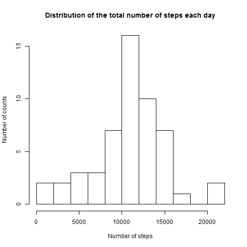
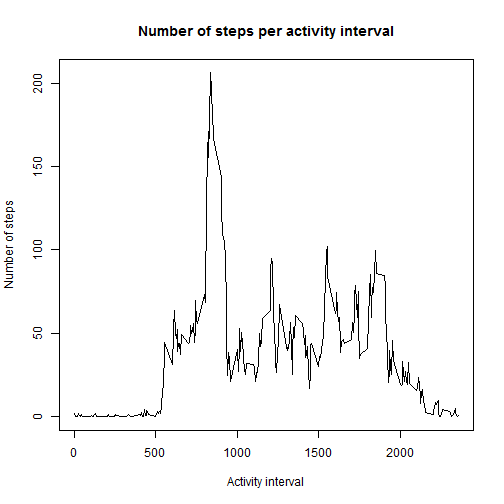
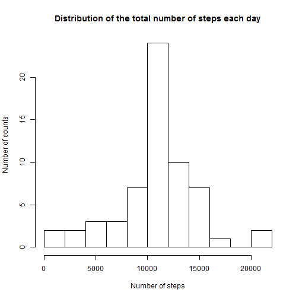
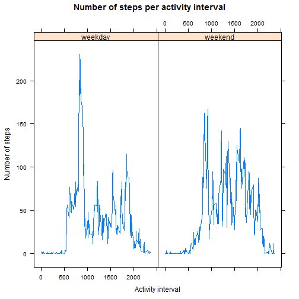

#Show any code that is needed to

1. Load the data (i.e. read.csv())
2. Process/transform the data (if necessary) into a format suitable for your analysis

## 1. Load the data

The file we are interested in is: activity.zip. Lets unzip it and read in the data. 


```r
zipFile<-"activity.zip"
unzip(zipFile)
files=list.files()
dataFile=files[grepl("activity.csv", files)]

stopifnot(length(dataFile)>0)

data=read.csv(dataFile)
```

Now, lets check the result. It looks like the date is read in as factor variable instead of date. Lets correct it:


```r
data$date=as.Date(data$date)
str(data)
```

```
## 'data.frame':	17568 obs. of  3 variables:
##  $ steps   : int  NA NA NA NA NA NA NA NA NA NA ...
##  $ date    : Date, format: "2012-10-01" "2012-10-01" ...
##  $ interval: int  0 5 10 15 20 25 30 35 40 45 ...
```

## 2. Process/transform the data

Although it looks like the interval is something like minutes within a day. This is **not** true as can be seen by the maximum values (should be 1440 for a day):


```r
summary(data$interval)
```

```
##    Min. 1st Qu.  Median    Mean 3rd Qu.    Max. 
##     0.0   588.8  1178.0  1178.0  1766.0  2355.0
```

Additionally, we need some helper function for melting and casting the data:


```r
library(reshape2)

# Args:
#       df:   Tha data frame containing the activity data. It is assumed that a 
#             variable called "date" and "interval" exists.
# Value:
#       The molten data frame.
meltAndIgnore=function(df){
  result=melt(df, id.vars = c("date", "interval"), na.rm=T)
  # Convert to double for the remaining mathemetical operations
  result$value=as.double(result$value)

  result
}

# Args:
#       df:   Tha data frame containing the activity data. It is assumed that a 
#             variable called "date", "interval" ad "weekday" exists.
# Value:
#       The molten data frame.
meltAndIgnoreWithWeekDay=function(df){
  result=melt(df, id.vars = c("date", "interval", "weekday"), na.rm=T)
  # Convert to double for the remaining mathemetical operations
  result$value=as.double(result$value)

  result
}
```

# What is mean total number of steps taken per day?

For this part of the assignment, you can ignore the missing values in the dataset.

1. Calculate the total number of steps taken per day
2. If you do not understand the difference between a histogram and a barplot, research the difference between them. Make a histogram of the total number of steps taken each day
3. Calculate and report the mean and median of the total number of steps taken per day

## 1. Calculate the total number of steps taken per day

We will now make use of the melting helper function we defined above and cast the stuff together by merging all steps values for all intervals together into a column called "total". The only discriminating feature should be date.


```r
dailyTotal=dcast(meltAndIgnore(data), date ~ "total", sum)
sum(dailyTotal$total)
```

```
## [1] 570608
```

## 2. Make a histogram of the total number of steps taken each day

Keep in mind: The following histogram **ignores** missing values.


```r
hist(dailyTotal$total, xlab="Number of steps", ylab="Number of counts", main="Distribution of the total number of steps each day", breaks=10)
```



## 3. Calculate and report the mean and median of the total number of steps taken per day

Lets calculate the mean and median values according to the total sum above and print it.


```r
sprintf("**Median**: %f, **Mean**: %f, **Total**: %f", median(dailyTotal$total), mean(dailyTotal$total), sum(dailyTotal$total))
```

[1] "**Median**: 10765.000000, **Mean**: 10766.188679, **Total**: 570608.000000"

# What is the average daily activity pattern?

1. Make a time series plot (i.e. type = "l") of the 5-minute interval (x-axis) and the average number of steps taken, averaged across all days (y-axis)
2. Which 5-minute interval, on average across all the days in the dataset, contains the maximum number of steps?

## 1. Time series plot of the 5-minute interval and the average number of steps taken, averaged across all days

Plot the data. Like in the case of the averaging over date above, we will use the helper function again to average over intervals now.


```r
intervalMean=dcast(meltAndIgnore(data), interval ~ "mean", mean)
plot(intervalMean$interval, intervalMean$mean, type="l", xlab="Activity interval", ylab="Number of steps", main="Number of steps per activity interval")
```



## 2. Which 5-minute interval, on average across all the days in the dataset, contains the maximum number of steps

Keep in mind: The intervals are a 5-step sequence and contains holes. Thus, calculating the maximum index is not enaough, we have to retrieve the name of the interval.


```r
intervalMean[which.max(intervalMean$mean), "interval"]
```

```
## [1] 835
```

# Imputing missing values

Note that there are a number of days/intervals where there are missing values (coded as NA). The presence of missing days may introduce bias into some calculations or summaries of the data.

1. Calculate and report the total number of missing values in the dataset (i.e. the total number of rows with NAs)
2. Devise a strategy for filling in all of the missing values in the dataset. The strategy does not need to be sophisticated. For example, you could use the mean/median for that day, or the mean for that 5-minute interval, etc.
3. Create a new dataset that is equal to the original dataset but with the missing data filled in.
4. Make a histogram of the total number of steps taken each day and Calculate and report the mean and median total number of steps taken per day. Do these values differ from the estimates from the first part of the assignment? What is the impact of imputing missing data on the estimates of the total daily number of steps?

## 1. Calculate and report the total number of missing values in the dataset


```r
missing=sum(is.na(data$steps))
total=nrow(data)
sprintf("Rows with missing steps: %d, total rows: %d, relation of missing values: %f", missing, total, missing/total)
```

```
## [1] "Rows with missing steps: 2304, total rows: 17568, relation of missing values: 0.131148"
```

## 2. Devise a strategy for filling in all of the missing values in the dataset / 3. Create a new dataset that is equal to the original dataset but with the missing data filled in

Every missing value should be replaced by its activity interval mean value. If there is for example an observation like:
  
  steps   date        interval
  NA      2012-10-01  5

and the activity interval means are:

  interval  mean
  5         12
  
the original observation will be replaced with:

  steps   date        interval
  12      2012-10-01  5


```r
intervalMean=dcast(meltAndIgnore(data), interval ~ "mean", mean, na.rm=T)
rownames(intervalMean)=intervalMean$interval
imputedData<-data
numberOfNAsBefore<-sum(is.na(imputedData$steps))
stepsAreNAHere<-which(is.na(imputedData$steps))
imputedData[stepsAreNAHere, 'steps']<-sapply(stepsAreNAHere, function(ind){
  intervalMean[as.character(imputedData[ind,]$interval), ]$mean
})
sprintf("Number of NAs before: %d, number of NAs after: %d", numberOfNAsBefore, sum(is.na(imputedData$steps)))
```

```
## [1] "Number of NAs before: 2304, number of NAs after: 0"
```

## 4. Histogram of the total number of steps taken each day, mean and median total number of steps taken per day

First, create again the average for each day, now with the imputed data.


```r
dailyTotalImputed=dcast(meltAndIgnore(imputedData), date ~ "total", sum)
```

Plot the histogram. It doesn't look **much** different than before ...


```r
hist(dailyTotalImputed$total, xlab="Number of steps", ylab="Number of counts", main="Distribution of the total number of steps each day", breaks=10)
```



but the values are slightly different:


```r
res=data.frame(mean=c(mean(dailyTotal$total), mean(dailyTotalImputed$total)), median=c(median(dailyTotal$total), median(dailyTotalImputed$total)), total=c(sum(dailyTotal$total), sum(dailyTotalImputed$total)))
rownames(res)<-c("Not imputed", "Imputed")
res
```

```
##                 mean   median    total
## Not imputed 10766.19 10765.00 570608.0
## Imputed     10766.19 10766.19 656737.5
```

As expected, the mean is not changed because the data was imputed with the mean values. Median also changes just a bit but as expected the total number increases quite a bit.

# Are there differences in activity patterns between weekdays and weekends?

For this part the weekdays() function may be of some help here. Use the dataset with the filled-in missing values for this part.

1. Create a new factor variable in the dataset with two levels - "weekday" and "weekend" indicating whether a given date is a weekday or weekend day.
2. Make a panel plot containing a time series plot (i.e. type = "l") of the 5-minute interval (x-axis) and the average number of steps taken, averaged across all weekday days or weekend days (y-axis). See the README file in the GitHub repository to see an example of what this plot should look like using simulated data.

## 1. Create a new factor variable

Creating a new factor variable is easy. To be language independent, using the wday-function instead of weekdays().


```r
library(lubridate)

imputedDataWeekday<-imputedData
imputedDataWeekday$weekday=factor(ifelse(wday(ymd(imputedDataWeekday$date)) %in% c(1, 7), "weekend", "weekday"))
```

## 2. Panel plot of the 5-minute interval and the average number of steps

Again, perform the game of melting and casting to get yet another mean value and plot it.


```r
library(lattice)

intervalMeanImputedWeekdays=dcast(meltAndIgnoreWithWeekDay(imputedDataWeekday), interval + weekday ~ "mean", mean, na.rm=T)
xyplot(mean ~ interval | weekday, intervalMeanImputedWeekdays, xlab="Activity interval", ylab="Number of steps", main="Number of steps per activity interval", type="l" )
```


